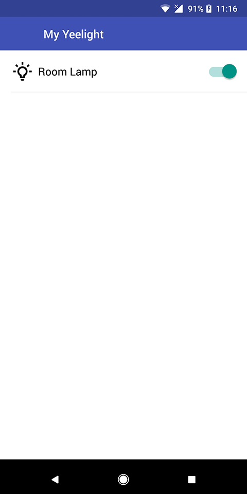
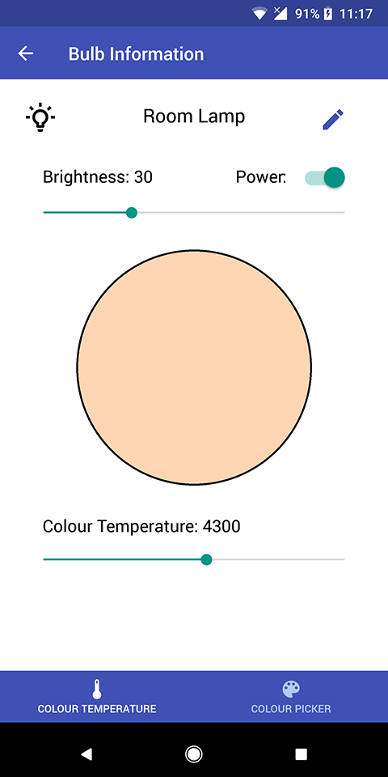
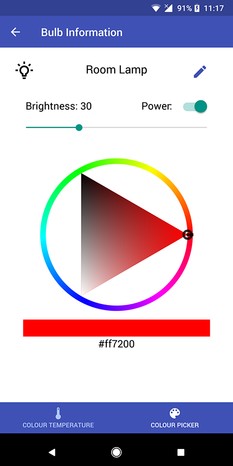

# My Yeelight

A simple app to control Yeelight bulbs.

[Yeelight WiFi Light Inter-Operation Specification](https://www.yeelight.com/en_US/developer).

Main react native packages used:
- [NativeBase](https://nativebase.io/)
- [react-native-udp](https://github.com/tradle/react-native-udp)
- [react-native-tcp](https://github.com/PeelTechnologies/react-native-tcp)
- [react-navigation](https://reactnavigation.org/)
- [react-native-dialog](https://github.com/mmazzarolo/react-native-dialog)
- [react-native-color-picker](https://github.com/instea/react-native-color-picker)

This project was bootstrapped with [Create React Native App](https://github.com/react-community/create-react-native-app).
